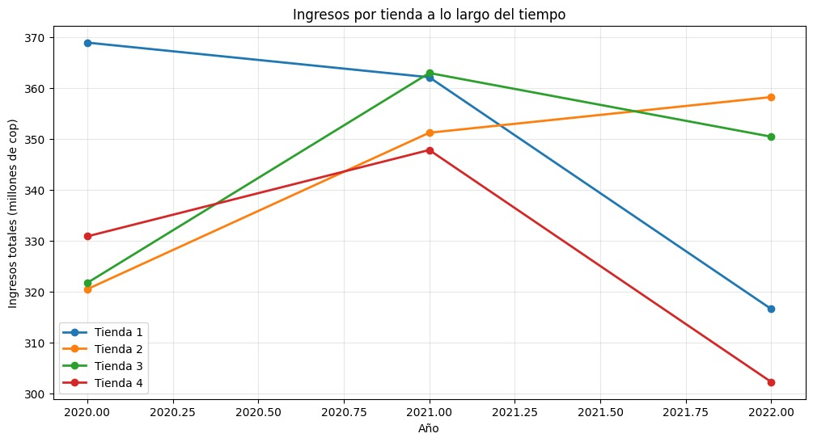
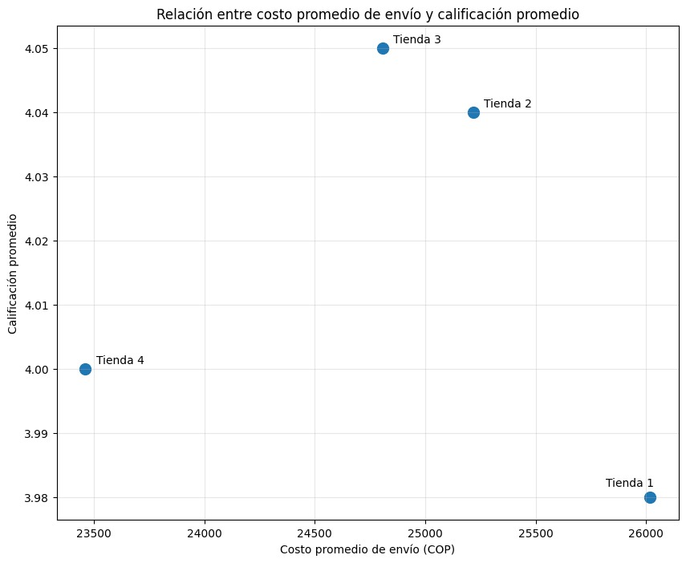
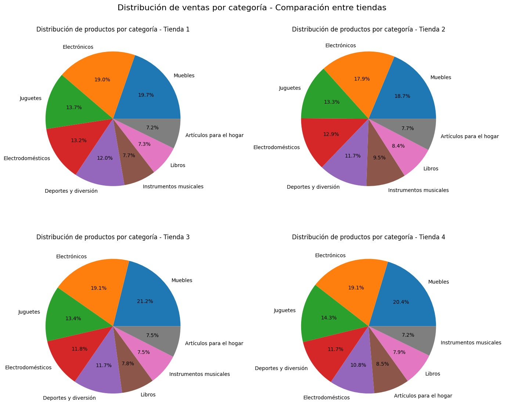
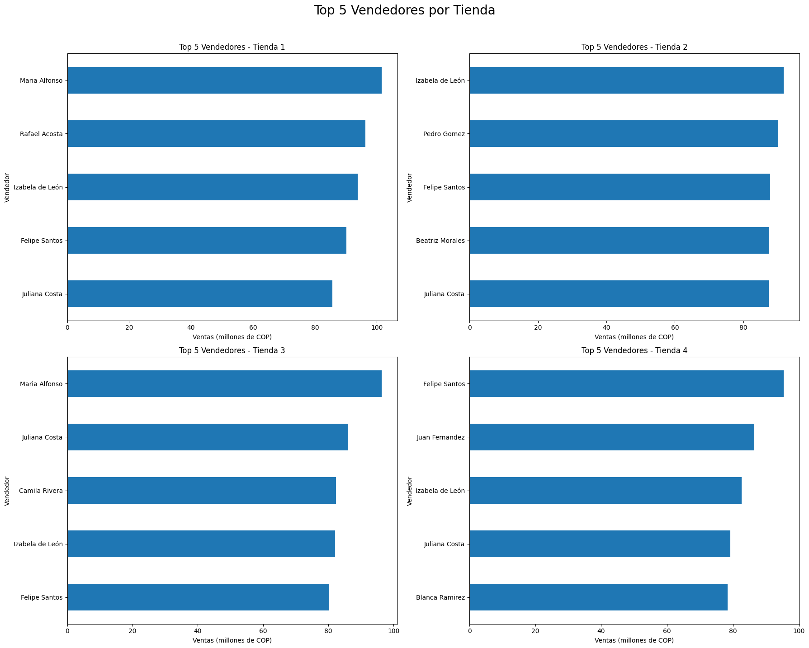

# AluraStoreLatam – Análisis de ventas de tiendas

**Proyecto de Análisis de Datos** — Challenge Final del Curso de Oracle / AluraLatam  
**Autor:** Juan Esteban Rodríguez Aranda

## 🎯 Objetivo  
Este proyecto analiza las ventas de cuatro tiendas identificadas como “Tienda 1” a “Tienda 4”. El objetivo es determinar cuál tienda debería vender el Sr. Juan para optimizar el portafolio empresarial — tomando en cuenta ingresos, desempeño de vendedores, rating de clientes, distribución de categorías, costos logísticos, entre otros.

## 🧩 Estructura del Repositorio
/ ← Main
├── notebook/ ← notebook principal con análisis (AluraStoreLatam.ipynb)
├── Data/ ← archivos CSV originales de las tiendas
├── assets/ ← gráficas e imágenes generadas por el análisis
├── README.md ← este archivo

## 📊 Contenido del Análisis  
- Gráfica de ingresos totales por tienda en el tiempo  
- Relación costo de envío vs. calificación promedio por tienda  
- Distribución de ventas por categoría — Comparativa entre tiendas  
- Top 5 vendedores por tienda (bar chart)  
- Conclusión recomendada: cuál tienda vender  

## 🛠️ Cómo ejecutar  
1. Clona el repositorio:
  git clone https://github.com/RientArlCroud/challenge2-an-lisis-de-datos.git
2. Abre con Google Colab el archivo `notebook/AluraStoreLatam.ipynb`.  
3. Asegúrate de tener instaladas las librerías `pandas` y `matplotlib`.  
4. Ejecuta todas las celdas para regenerar los gráficos.  

## 🚀 Resultados destacados  

### Ingresos por tienda a lo largo del tiempo  
  

### Costo de envío vs. Calificación promedio  
  

### Distribución de ventas por categoría  
  

### Top 5 Vendedores por tienda  
  

## ✅ Conclusión  
Tras el análisis comparativo, se recomienda que el Sr. Juan considere **vender la “Tienda 1”**. Esta tienda presenta una caída sostenida en ingresos, tasas de satisfacción más bajas, costo de envío elevado y desempeño de vendedores que no compensa las debilidades estructurales.

---

*Este README.md forma parte del entregable del Challenge de Análisis de Datos de AluraLatam — Noviembre 2025.*
